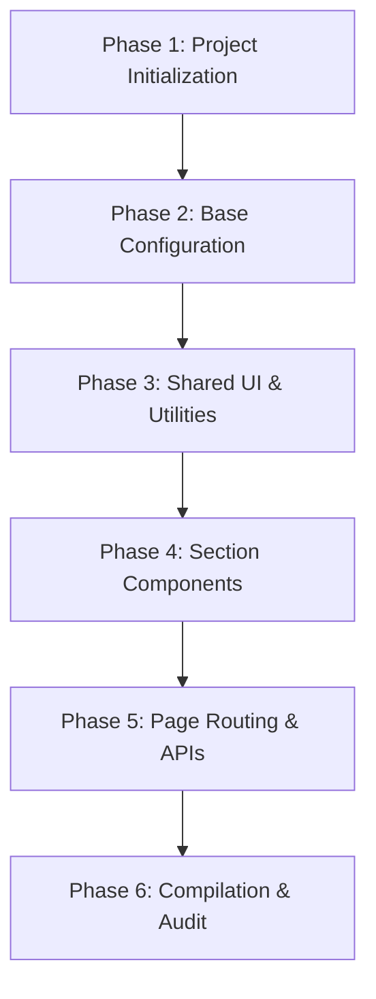

# Implementation Plan: Wedding Invitation Web App (Sprint 1)

This step-by-step implementation plan outlines the exact timeline, files, commands, and code blocks needed to complete Sprint 1 of the Wedding Invitation Web App.

---

## 📅 Phases of Execution

### 🛠️ Phase 1: Project Setup & Dependencies
1.  **Check CLI help flags**: Comply with system rules by running `npx create-next-app@14.2.3 --help`.
2.  **Scaffold Next.js 14**: Initialize the Next.js project in the current directory with `create-next-app` using TypeScript, Tailwind, ESLint, App Router, and dynamic source configuration.
3.  **Install Packages**: Install `framer-motion`, `lucide-react`, `firebase`, and `firebase-admin`.
4.  **Configure `.env.local`**: Add the Firebase client API config variables provided by the user.

### 📐 Phase 2: Base Infrastructure
1.  **TypeScript Types (`/types/wedding.ts`)**: Define data interfaces for the wedding information, bank accounts, e-wallets, and RSVP submissions.
2.  **Firebase Client Config (`/lib/firebase.ts`)**: Initialize standard Client SDK modules.
3.  **Firebase Admin Config (`/lib/firebase-admin.ts`)**: Configure Server Admin SDK initialization with safe private key format mapping.
4.  **Fallback Engine (`/lib/wedding.ts`)**: Write the fetch helper that checks for real database connectivity and falls back to a high-fidelity static JSON response if credentials are not configured.
5.  **Animation Variants (`/lib/animations.ts`)**: Define reusable Framer Motion transition setups (`fadeUp`, `fadeIn`, `scaleIn`, `staggerContainer`).
6.  **Global Styles (`/app/globals.css`)**: Setup the `:root` variables, core styles, scroll-behavior, and keyframes for `float-petal`, `spin-vinyl`, and `pulse-cta`.
7.  **Fonts & Layout (`/app/layout.tsx`)**: Load `Great Vibes`, `Cormorant Garamond`, and `Plus Jakarta Sans` Google Fonts dynamically.

### 🌿 Phase 3: Shared UI Components
1.  **Floral Divider (`/components/ui/FloralDivider.tsx`)**: Design beautiful inline SVGs with "branch", "simple", and "ornate" options.
2.  **Countdown Timer (`/components/ui/CountdownTimer.tsx`)**: Implement a countdown calculation module that ticks down to the target date.

### 💑 Phase 4: Core Page Components
1.  **`OpeningOverlay.tsx`**: Create the welcome splash screen with customized guest parsing, wreath SVG frame, and audio start trigger.
2.  **`PasswordGate.tsx`**: Add the blurred privacy overlay with incorrect check shake feedback and 60-second cooldown lock rules.
3.  **`CoverSection.tsx`**: Build the full-screen visual hero with dark gradients, initials, countdown timer, and chevron scroll-indicator.
4.  **`MempelaiSection.tsx`**: Create the portrait card bio components enclosed in circular botanical borders.
5.  **`AkadResepsiSection.tsx`**: Design Akad & Resepsi detail cards with Google Maps links and auto-calendar `.ics` generators.
6.  **`GallerySection.tsx`**: Build an editorial masonry grid alongside a swipe-gesture responsive touch lightbox.
7.  **`RSVPSection.tsx`**: Add the attendance radio selectors, numerical guest stepper, text input, and live updates ticker.
8.  **`GiftSection.tsx`**: Implement bank copy controls, custom slide-up toast triggers, and WhatsApp confirmation templates.
9.  **`MusicPlayer.tsx`**: Create the floating audio disk widget.
10. **`WeddingInvitation.tsx`**: Combine all sub-sections into a single, cohesive client container coordinating transitions.

### 🚀 Phase 5: Routing & API Routes
1.  **Dynamic Router (`/app/[slug]/page.tsx`)**: Fetch and serve the metadata headers and the invitation profile.
2.  **Loading Component (`/app/[slug]/loading.tsx`)**: Create the custom skeleton frame.
3.  **RSVP POST API (`/app/[slug]/rsvp/route.ts`)**: Handle server-side validations and save to Firestore (or output mock success results).

### 🧪 Phase 6: Compilation & Verification
1.  **Verify Layouts**: Confirm that viewports do not experience horizontal overflows on mobile breakpoints.
2.  **Perform Production Compilation**: Run `npm run build` to confirm absolute stability, error-free types, and optimized assets.
